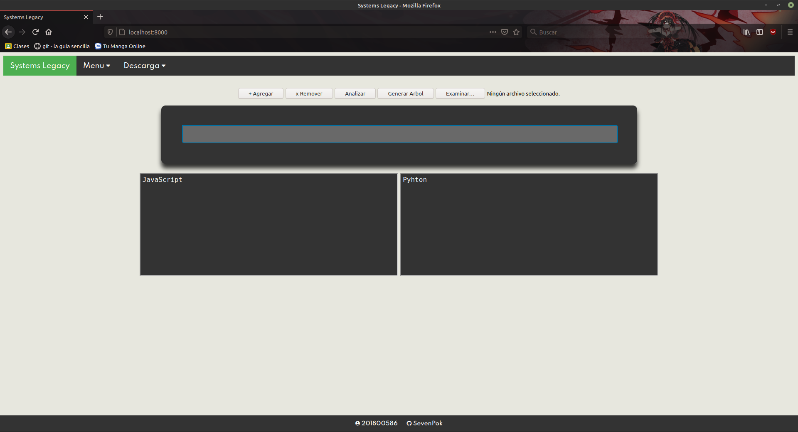
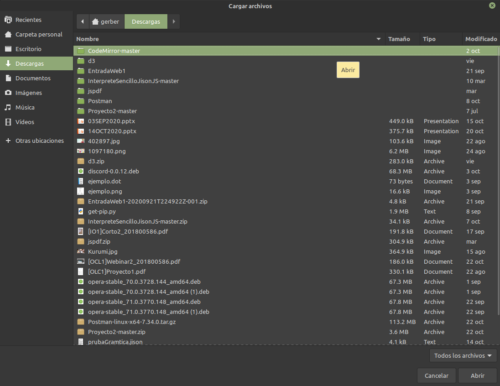
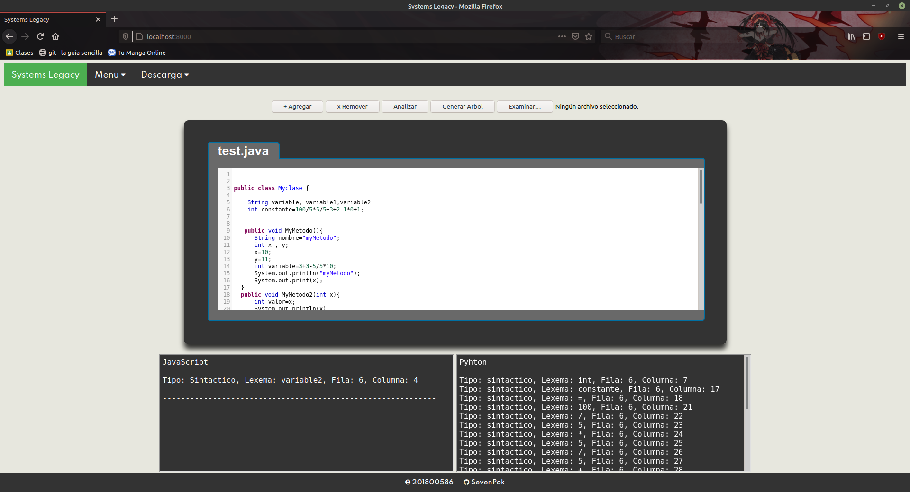
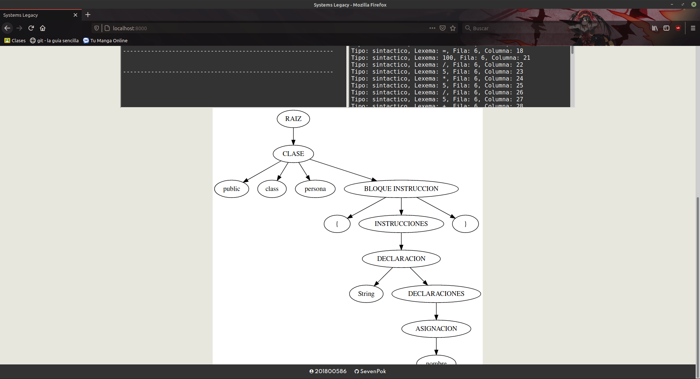
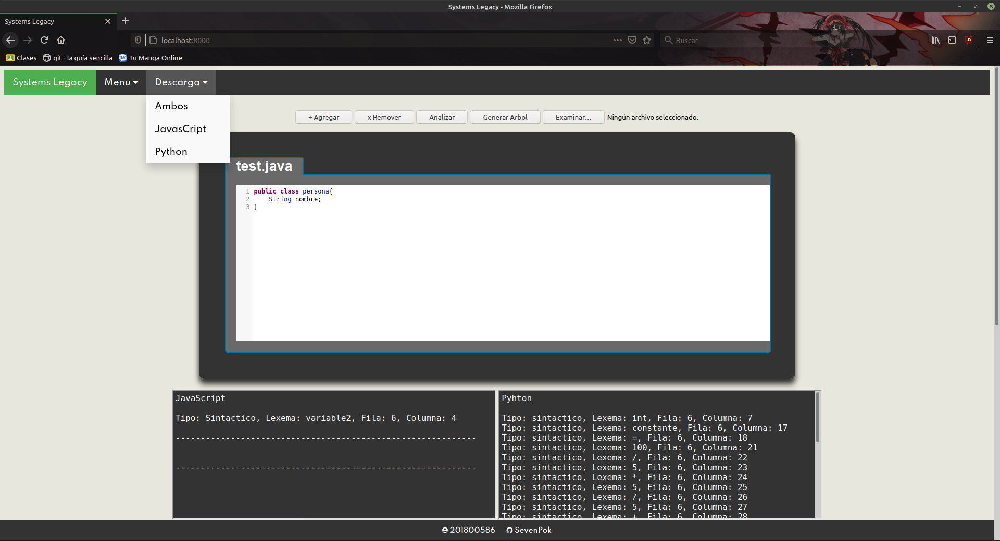

# Manual de Usuario
Para el uso de la aplicacion web solo se necesito la conexion a internet y un navegador.

## Inicio de la APP
Al abrir la aplicacion y los servidores funcionan exitosamente le saldra el inicio de la APP, ademas tiene los siguientes botones:
    
    -Agregar
    -Remover
    -Analizar
    -Generar arbol
    -Examinar

## Agregar pestaña

## Examinar

## Añadir archivo

## Analizar
Al momento de darle al boton la app devolvera un error en las consolas, si realmente encontro un error.

## Generar Arbol

## Reportes
EL apartado de reportes se podra descargar el archivo con la lista de tokens, errores y traducido al lenguaje deceado.

# Manual Técnico
## Servidor Node JS
#### Para el uso del servidor del lado de la traduccion se uso node js, express y cors para poder levantarlo y hacer las peticioens correspondientes.
#### Este contiene el modulo **Inpterpreter** y contiene los siguientes archivos:

>  1. **gramatica.jison:** Este contiene las palabras reservadas que aceptara el lenguaje y los retornara en forma de tokens, ademas se establecio la gramatica del lenguaje para aceptar la sintaxis correcta edel mismo.

>  2. **gramatica.js:** Este es el archivo resultante de haber compiolado el archivo jison en un formato que sea reconocido y aceptado por el servidor.

>  3. **java.js:** Este archivo contiene los metodos de retornar los tokens, errores, AST y la traduccion del lenguaje.

## Lista de tokens

| Lexema | Token | Patron |
| -- | -- | -- |
| {  | KEY_LEFT | "{" |
| }  | KEY_RIGHT | "}" |
| (  | PAR_LEFT | "(" |
| )  | PAR_RIGHT |  ")" |
| [  | COR_LEFT |  "[" |
| ]  | COR_RIGHT |  "]" |
| ++ | INCREMENTO |  "++" |
| +  | MAS |  "+" |
| --  | DECREMENTO |  "--" |
| -  | MENOS |  "-" |
| *  | POR |  "*" |
| /  | DIV |  "/" |
| &&  | AND |  "&&" |
| \| \|  | OR |  "\|\|" |
| !=  | DIFERENTE |  "!=" |
| ! | NOT |  "!" |
| ^  | XOR |  "^" |
| >=  | MAYOR_IGUAL |  ">=" |
| >  | MAYOR |  ">" |
| <=  | MENOR_IGUAL |  "<=" |
| <  | MENOR |  "<" |
| ==  | IGUAL |  "==" |
| =  | ASIGNAR |  "=" |
| . | PUNTO |  "."|
| :  | DOS_PUNTOS |  ":" |
| ,  | COMA |  "," |
| ;  | PUNTO_COMA |  ";" |
| public  | PUBLIC | "public" |
| class  | CLASS | "class" |
| interface  | INTERFACE | "interface" |
| static  | STATIC | "static" |
| for  | FOR | "for" |
| while  | WHILE | "while" |
| do  | DO | "do" |
| if  | IF | "if" |
| else  | ELSE | "else" |
| true  | TRUE | "true" |
| false  | FALSE | "false" |
| continue  | CONTINUE | "continue" |
| break  | BREAK | "break" |
| void  | VOID | "void" |
| int  | INT | "int" |
| double  | DOUBLE | "double" |
| String  | STRING | "String" |
| char  | CHAR | "char" |
| boolean  | BOOLEAN | "boolean" |
| main  | MAIN | "main" |
| args  | ARGS | "args" |
| System.out.print  | PRINT | "System.out.print" |
| System.out.println  | PRINT | "System.out.println" |
| id  | IDENTIFICADOR | "[a-zA-Z_][a-zA-Z0-9_]" |
| "cadena"  | CADENA | " \"[^\"]*\" " |
| 'caracter'  | CARACTER | "\'[^\']*\'" |
| 52.52  | DECIMAL | "[0-9]+"."[0-9]+" |
| 1000  | ENTERO | "[0-9]+\b" |
| eof  | EOF | Final del archivo |

## Gramatica
>**ini** -> header EOF  
\| EOF

>**headers** -> headers head  
\| head

>**head** -> clase  
\| interface  
\| error

>**bloque_instruccion** -> KEY_LEFT instrucciones KEY_RIGHT  
\| KEY_LEFT KEY_RIGHT

>**bloque_instruccion2** -> KEY_LEFT instrucciones2 KEY_RIGHT  
\| KEY_LEFT KEY_RIGHT

>**instrucciones** -> instrucciones instruccion  
\| instruccion

>**instruccion** -> declaracion PUNTO_COMA  
\| asignacion  PUNTO_COMA  
\| main \| metodo  
\| error

>**instrucciones2** -> instrucciones2 instruccion2  
\| instruccion2

>**instruccion2** -> metodo2 PUNTO_COMA  
\| error

>**sentencia** -> declaracion PUNTO_COMA  
\| asignacion  PUNTO_COMA  
\| call_metodo PUNTO_COMA  
\| if \| while \| do PUNTO_COMA  
\| for \|print PUNTO_COMA  
\|return PUNTO_COMA      
\|   CONTINUE PUNTO_COMA     
\|   BREAK PUNTO_COMA      
\|   incremento PUNTO_COMA    
\|   error

>**sentencias** -> sentencias sentencia  
\| sentencia

>**clase** -> PUBLIC CLASS IDENTIFICADOR bloque_instruccion

>**interface** -> PUBLIC INTERFACE IDENTIFICADOR bloque_instruccion2

>**bloque_sentencia** -> KEY_LEFT sentencias KEY_RIGHT  
\| KEY_LEFT KEY_RIGHT

>**declaracion** -> tipo declaraciones

>**declaraciones** -> declaraciones COMA decla  
\| decla

>**decla** -> IDENTIFICADOR ASIGNAR expresion  
\| IDENTIFICADOR

>**asignacion** -> IDENTIFICADOR ASIGNAR expresion

>**if** -> IF PAR_LEFT expresion PAR_RIGHT bloque_sentencia  
\| IF PAR_LEFT expresion PAR_RIGHT bloque_sentencia ELSE bloque_sentencia  
\| IF PAR_LEFT expresion PAR_RIGHT bloque_sentencia ELSE if

>**while** -> WHILE PAR_LEFT expresion PAR_RIGHT bloque_sentencia

>**do** -> DO bloque_sentencia WHILE PAR_LEFT expresion PAR_RIGHT

>**for** -> FOR PAR_LEFT declaracion PUNTO_COMA expresion PUNTO_COMA expresion PAR_RIGHT bloque_sentencia

>**incremento** -> IDENTIFICADOR INCREMENTO  
\| IDENTIFICADOR DECREMENTO

>**print** -> PRINT PAR_LEFT expresion PAR_RIGHT

>**main** -> PUBLIC STATIC VOID MAIN PAR_LEFT STRING COR_LEFT COR_RIGHT ARGS PAR_RIGHT bloque_sentencia

>**metodo** -> PUBLIC VOID IDENTIFICADOR PAR_LEFT parametros PAR_RIGHT bloque_sentencia   
 \| PUBLIC tipo IDENTIFICADOR PAR_LEFT parametros PAR_RIGHT bloque_sentencia  
 \| PUBLIC VOID IDENTIFICADOR PAR_LEFT PAR_RIGHT bloque_sentencia  
 \| PUBLIC tipo IDENTIFICADOR PAR_LEFT PAR_RIGHT bloque_sentencia 

>**metodo2** -> PUBLIC VOID IDENTIFICADOR PAR_LEFT parametros PAR_RIGHT  
 \| PUBLIC tipo IDENTIFICADOR PAR_LEFT parametros PAR_RIGHT  
 \| PUBLIC VOID IDENTIFICADOR PAR_LEFT PAR_RIGHT  
 \| PUBLIC tipo IDENTIFICADOR PAR_LEFT PAR_RIGHT

>**call_metodo** -> IDENTIFICADOR PAR_LEFT valores PAR_RIGHT  
\| IDENTIFICADOR PAR_LEFT PAR_RIGHT

>**valores** -> valores COMA expresion  
\| expresion

>**parametros** -> parametros COMA parametro  
\| parametro

>**parametro** -> tipo IDENTIFICADOR

>**return** -> RETURN expresion  
\| RETURN

>**expresion** -> expresion MAS expresion  
    \|   expresion MENOS expresion       
    \|   expresion POR expresion         
    \|   expresion DIV expresion         
    \|   MENOS expresion %prec UMENOS   
    \|   primitivo                       
    \|   expresion IGUAL expresion       
    \|   expresion DIFERENTE expresion   
    \|   expresion MAYOR expresion       
    \|   expresion MENOR expresion       
    \|   expresion MAYOR_IGUAL expresion  
    \|   expresion MENOR_IGUAL expresion   
    \|   expresion AND expresion         
    \|   expresion OR expresion          
    \|   NOT expresion %prec UMENOS      
    \|   PAR_LEFT expresion PAR_RIGHT    
    \|   incremento

>**tipo** -> INT  
    \|   DOUBLE   
    \|   STRING  
    \|   CHAR    
    \|   BOOLEAN  

>**primitivo** -> IDENTIFICADOR  
    \|   ENTERO          
    \|   DECIMAL         
    \|   CADENA          
    \|   CARACTER        
    \|   TRUE            
    \|   FALSE                             